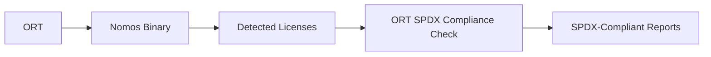

<h2><i>Integrating FOSSology with ORT @ <a href = "https://www.fossology.org/">FOSSology </a> </i></h2>

	<a href="#project-details">Project Details</a> | 
	<a href="#contributions">Contributions</a> | 
	<a href="#deliverables">Deliverables</a> |
    <a href="periodic-report">Periodic Report</a> | 
	<a href="#future-goals">Future Goals</a> | 
	<a href="#key-takeaways">Key Takeaways</a> |
    <a href="#acknowledgement">Acknowledgements</a>

<h1 align = "center" id = "project-details">Project Details </h1>
This project focused on integrating FOSSology’s license scanning capabilities into the OSS Review Toolkit (ORT) by developing a dedicated scanner plugin. Instead of building a full server-based integration, we chose a lightweight approach using FOSSology’s Nomos agent.

I implemented a new scanner plugin in ORT that invokes the Nomos binary for license detection. On the FOSSology side, I also prepared a standalone release of the Nomos agent to make it easier to use outside the full server environment.

Together, these contributions enable ORT users to seamlessly run FOSSology (via Nomos) within their existing dependency analysis workflows.

<h1 align = "center" id = "contributions"> Contributions </h1>

## Overview of Technical Work

### Project Architecture & Technical Approach
- **Integration Strategy**  
   We chose the Nomos agent instead of the full FOSSology server because it provides a lightweight, binary-level integration. Running the full server would have required database setup and orchestration of multiple agents, which was unnecessary for ORT’s scanner plugin model.  

- **Technical Decision Rationale**  
   ORT is designed around modular scanners that can run independently. A server-based integration would have been heavyweight, introducing more complexity. Packaging Nomos as a standalone binary enabled faster setup, fewer dependencies, and reproducibility.  

- **Architecture Design**  
    - ORT invokes the Nomos binary on each source file  
    - Nomos scans each file for licenses  
    - The results are parsed into ORT’s internal model  
    - ORT passes the detected licenses through its SPDX compliance function  
    - The SPDX-checked results are then processed by ORT’s reporting pipeline to generate SPDX-compliant reports 
   

## Major Deliverables

### 1. ORT Scanner Plugin Development
I developed a new scanner plugin for ORT that integrates the FOSSology Nomos license detection agent.
#### *Implementation Details*
- **Plugin Architecture**: The plugin follows ORT’s modular scanner interface, which allows third-party scanners to be easily added. This design ensured that Nomos could be seamlessly integrated without altering ORT’s core functionality.
- **Nomos Integration Logic**: The plugin invokes the Nomos binary on each file within the source tree. The raw output is then parsed and mapped into ORT’s internal data model.
- **Configuration Management**: Users can configure the plugin through nomos configuration files, enabling flexibility.

#### *Technical Specifications*
- **Supported File Types**: Nomos supports scanning plain text source files, scripts, and documentation, which covers a wide range of common open-source artifacts.
- **Memory Management**: The plugin avoids storing unnecessary intermediate results and streams the Nomos output directly into ORT’s parser.
- **Threading Model**: Nomos itself provides a flag to control the number of CPUs used during scanning. The plugin leverages this feature to enable parallel execution on multi-core systems.

### 2. FOSSology Nomos Standalone Release
On the FOSSology side, I prepared a standalone release of the Nomos agent.
#### *Standalone Agent Development*
- **Build Process**: Compiled Nomos directly from the FOSSology source with build options configured to only include the Nomos agent to be used as a static executable.
- **Dependency Management**: By enabling static linking, the resulting executable includes all required libraries internally, removing the need for additional runtime dependencies.
- **Lightweight Distribution**: This makes the binary portable and easier to run in different environments, without requiring the full FOSSology stack or complex setup steps.

#### *Integration Capabilities*
- **CLI Execution**: Nomos is provided as a simple binary that can be called directly by ORT or other tools.
- **Output Format**: Retains the standard json output of Nomos, which is parsed by ORT’s plugin.
- **Usability**: The standalone binary allows ORT users to benefit from FOSSology’s license scanning without installing the complete server infrastructure.

### 3. ORT Docker Integration of Nomos
#### *Containerization & Usability*
- **Nomos Integration in ORT Dockerfile**: Bundled the Nomos standalone binary into ORT’s Docker image for seamless execution.
- **Executable Setup**: Automated steps to make Nomos runnable directly inside the ORT container.

- **User Experience**: ORT users can now run Nomos-based scanning out-of-the-box without extra installation.

- **Consistency & Reproducibility**: Ensures the same scanning environment across all setups using ORT’s Docker image.

## Code Contributions & Pull Requests

### Pull Requests Authored
#### *ORT Repository Contributions*
- **PR #[10631]**: [scanner: Add Nomos plugin] - [Status: Under Review]
  - **Description**: Introduced a new scanner plugin to integrate FOSSology's Nomos agent into ORT for license detection.
  - **Technical Details**: Developed a scanner class that invokes the Nomos binary, parses its output, and integrates the results into ORT's license model.
  - **Impact**: Enhanced ORT's capability to detect licenses using FOSSology's Nomos agent.

#### *ORT Repository Contributions*
- **PR #[10764]**: [chore(docker): Add FOSSology Nomos binary to docker image] - [Status: Under Review]
  - **Description**: Added the Nomos binary to ORT's Docker image to facilitate seamless license scanning.
  - **Technical Details**: Modified Dockerfile to include the Nomos static binary, ensuring it's executable within the container.
  - **Impact**: Simplified the setup process for users by providing an out-of-the-box solution for license scanning.

#### *FOSSology Repository Contributions*
- **PR #[3100]**: [feat(release): add job to upload nomos binary] - [Status: Under Review]
  - **Description**: Implemented a CI job to automate the uploading of the Nomos binary for standalone use.
  - **Standalone Release**: Configured the build system to produce a statically linked Nomos binary, reducing unnecessary dependencies.
  - **Documentation**: Updated release notes and build documentation to guide users on utilizing the standalone Nomos agent.
  - **Impact**: Provided a portable version of the Nomos agent, enabling its use outside the FOSSology server environment.

## Technical Implementation Deep Dive

### Integration Workflow
#### *Scanner Invocation Process*
1. **Initialization**: The ORT framework discovers and loads the FOSSology scanner by registering the `nomossa` plugin within its scanning pipeline. This registration allows ORT to recognize and invoke the Nomos binary during analysis.
2. **File Processing**: ORT processes source files in batches, preparing them for scanning. The plugin handles file paths and configurations to ensure each file is appropriately analyzed.
3. **Nomos Execution**: The plugin invokes the Nomos binary with specified flags, including:
- `J`: Outputs results in JSON format, providing a structured base for parsing.
- `S`: Produces detailed scan results in plain text. When combined with `-J`, it includes additional information such as byte offsets of detected licenses.
- `l`: Includes the full file paths of the scanned files in the output.
- `d`: Specifies the directory to scan.
- `n`: Sets the number of CPU cores to use for scanning. The plugin calculates `n-1` cores dynamically using ORT’s function, ensuring Nomos runs efficiently without consuming all system resources.
4. **Result Parsing**: The JSON output from Nomos is parsed to extract license information. This data is then mapped to ORT's internal model for further processing.
5. **Integration**: The parsed and SPDX-compliant license data is integrated into ORT's reporting pipeline, generating detailed reports for users.

#### *Data Flow Architecture*
- **Input Processing**: Source code files are prepared for scanning by the ORT framework, ensuring they are accessible and correctly formatted.
- **License Detection**: Nomos scans each file for license information, utilizing its CLI interface to detect and report licenses.
- **Result Aggregation**: The results from Nomos are aggregated and mapped to ORT's internal model, aligning with its data structures.
- **Output Generation**: ORT processes the aggregated data to generate comprehensive, SPDX-compliant reports detailing the detected licenses.

### Performance & Scalability
#### *Benchmarking Results*
- **Scan Performance**: Comparative analysis indicates that Nomos performs efficiently in detecting licenses, with scan times comparable to other scanners integrated into ORT.
- **System Usage**: Resource consumption is optimized by configuring Nomos to utilize a specified number of CPU cores, balancing performance and system load.
- **Scalability Testing**: The integration has been tested on large codebases, demonstrating Nomos's capability to handle extensive projects without significant performance degradation.

#### *Optimization Techniques*
- **Parallel Processing**: Nomos's ability to utilize multiple CPU cores has been leveraged, allowing for parallel processing and reduced scan times.

### Open Source Contributions
#### *Knowledge Sharing*
- **Technical Blog Posts**: Weekly updates have been shared, detailing the integration process, challenges faced, and solutions implemented. These posts provide insights into the development journey and serve as a resource for future contributors.
- **Community Presentations**: Demonstrations of the Nomos integration with ORT have been presented to then FOSSology community, showcasing the functionality and benefits of the integration.

## Code Quality & Standards

### Development Practices
#### *Coding Standards*
- **Style Guidelines**: Followed ORT and FOSSology project conventions, ensuring consistency across Kotlin and Dockerfiles.
- **Performance Best Practices**: Implemented efficient patterns such as streaming Nomos output directly, caching, and parallel execution to optimize resource usage.

#### **Version Control**
- **Commit Message Standards**: Wrote clear, descriptive commit messages to summarize changes effectively.
- **Branch Management**: Used feature branches for each major task (scanner plugin, Docker integration, Nomos standalone build), ensuring clean separation of work.
- **Code Review Integration**: Submitted all changes via pull requests and incorporated feedback from maintainers to improve quality, maintainability, and alignment with project standards.

<h1 align="center" id="periodic-report"> Periodic Report </h1>

Throughout the 11 weeks of the GSoC period, I consistently created weekly documentation to track and record my progress. Week-wise documentation can be found in the following links:

-   [Week 1](https://fossology.github.io/gsoc/docs/2025/oss-review-toolkit/updates/2025-06-07)
-   [Week 2](https://fossology.github.io/gsoc/docs/2025/oss-review-toolkit/updates/2025-06-14)
-   [Week 3](https://fossology.github.io/gsoc/docs/2025/oss-review-toolkit/updates/2025-06-21)
-   [Week 4](https://fossology.github.io/gsoc/docs/2025/oss-review-toolkit/updates/2025-06-28)
-   [Week 5](https://fossology.github.io/gsoc/docs/2025/oss-review-toolkit/updates/2025-07-05)
-   [Week 6](https://fossology.github.io/gsoc/docs/2025/oss-review-toolkit/updates/2025-07-26)
-   [Week 7](https://fossology.github.io/gsoc/docs/2025/oss-review-toolkit/updates/2025-08-02)
-   [Week 8](https://fossology.github.io/gsoc/docs/2025/oss-review-toolkit/updates/2025-08-09)
-   [Week 9](https://fossology.github.io/gsoc/docs/2025/oss-review-toolkit/updates/2025-08-16)
-   [Week 10]()
-   [Week 11]()

<h1 align="center" id = "future-goals"> Future Goals  </h1>

- **Long Term Maintainence**: Keep the Nomos plugin updated with ORT changes and ensure it continues to work reliably over time.
- **Reliability**: Ensure the plugin and Docker integration remain stable across different environments and large codebases.
- **Future Enhancements**: Explore adding support for additional file types and optimizing performance for large-scale projects.

<h1 align="center" id = "key-takeaways"> Key Takeaways </h1>

- **Hands-On Experience**: Gained practical exposure to ORT and FOSSology architectures, C/C++, Kotlin, and Docker-based tool integration.
- **Problem-Solving**: Learned to make design decisions balancing usability, performance, and maintainability (e.g., CPU core management, merging outputs).
- **Collaboration & Mentorship**: Improved skills in working with open-source communities, following code standards, and incorporating mentor feedback.
- **Documentation & Knowledge Sharing**: Understood the value of weekly updates, blogs, and clear documentation for knowledge transfer and reproducibility.
- **Adaptability**: Managed overlapping responsibilities like exams while maintaining consistent project progress.

<h1 align="center" id = "acknowledgement"> Acknowledgements </h1>

I would like to sincerely thank my mentors [Kaushal Kumar](https://www.linkedin.com/in/kaushl2208/), [Gaurav Mishra](https://www.linkedin.com/in/gmishx/), and [Shaheem Azmal M MD.](https://www.linkedin.com/in/shaheem-azmal-m-md-71604429/). Their guidance and support were invaluable throughout this project. Whenever I faced challenges or got stuck, they patiently helped me understand and overcome the issues, teaching me many things I did not know before.  

I truly enjoyed this experience — it was challenging at times, but these challenges helped me learn and grow as a developer. The mentorship and knowledge I received made this GSoC journey meaningful and rewarding.

# Reach out to me  

Feel free to connect and collaborate! You can reach me through:

- **LinkedIn:** [My professional network](https://www.linkedin.com/in/prakash-mishra-0a56472b9/)
- **GitHub:** [My open source projects](https://github.com/Prakash-Mishra-9ghz)  
- **Email:** [Send me a message](mailto:prakashmishra9921@gmail.com)  

